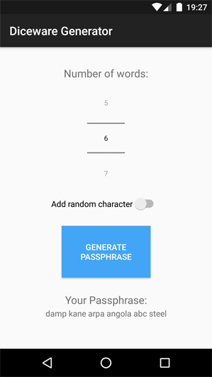

# Diceware Generator

A tiny Android app to generate passphrases using the [Diceware method](https://theworld.com/~reinhold/diceware.html) based on the cryptographically strong random number generator [SecureRandom](https://docs.oracle.com/javase/8/docs/api/java/security/SecureRandom.html) and the [diceware8k wordlist](https://theworld.com/~reinhold/dicewarefaq.html#computer).

Diceware randomly picks a certain number of words (usually five or more) from a predefined list and concatenates them to form a secure and easily remembered passphrase. Additionally, a random character can be inserted into the passphrase to make it even more secure without adding another word.

